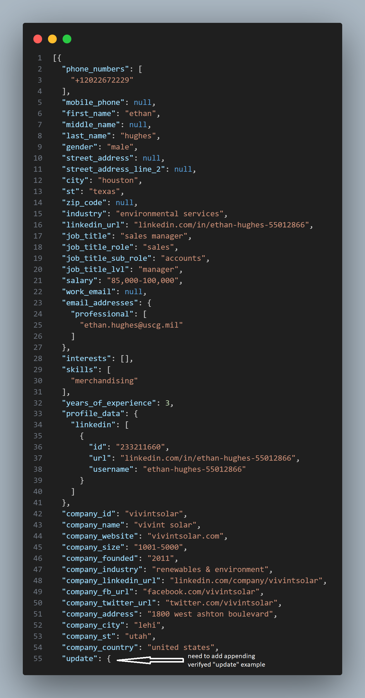
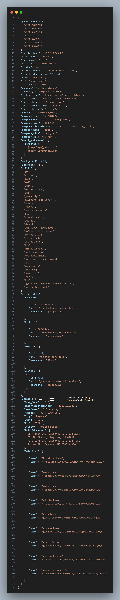
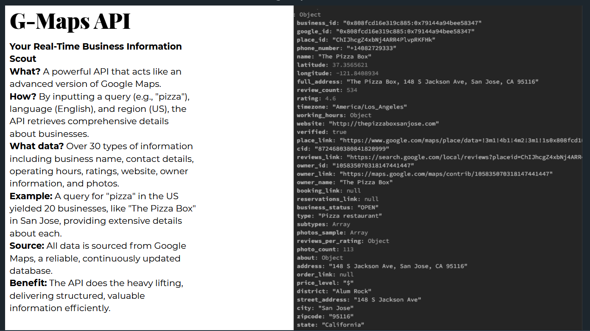
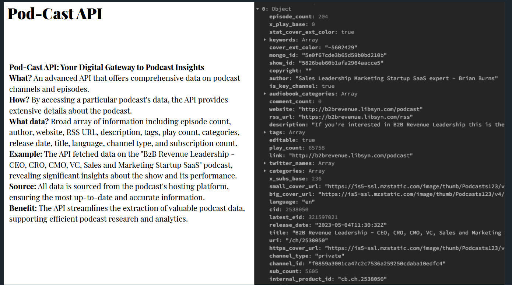

# Building a Lead-Generation Tool

## Overview

We aim to build a comprehensive lead-generation tool with several key features, enhancing the connection between our customers and our database, and offering them a suite of tools to validate and retrieve data efficiently.

---

## The Database Tab

This feature connects customers directly to our JSON database, currently hosted in MongoDB. If necessary, we can remap the database to SQL, depending on your preference.

### Validators

In addition to basic database access, customers will have the ability to verify various data points. These include:

- LinkedIn profile scraping
    
- Email verification
    
- Phone number verification
    Same like Email verification, LinkedIn profile scraping

The APIs for these validators are already developed and have been tested.

---

## The Tools Section

The tools section will house APIs designed to allow our customers to search and retrieve data in real-time. These APIs are also fully developed and tested, ensuring reliable performance.
- G-Maps API
    
- Pod-Cast API
    
- SEO Audit API
    

---

## Customer Access and Credits

Upon logging in, customers will find three tabs:

1. **Database**: Customers can access and pull data based on their available credits.
2. **Tools**: The tools section also operates on a credit system.
3. **Dashboard**: Here, customers can track their usage and other relevant details.

Each customer's access to the database and tools sections is determined by their available credits.

---

## The Dashboard

The dashboard is a personal space for customers to monitor their usage. It provides a clear and concise overview of credit consumption and data access, offering insights into their usage patterns.

---

This concludes our presentation. Thank you for your attention!
